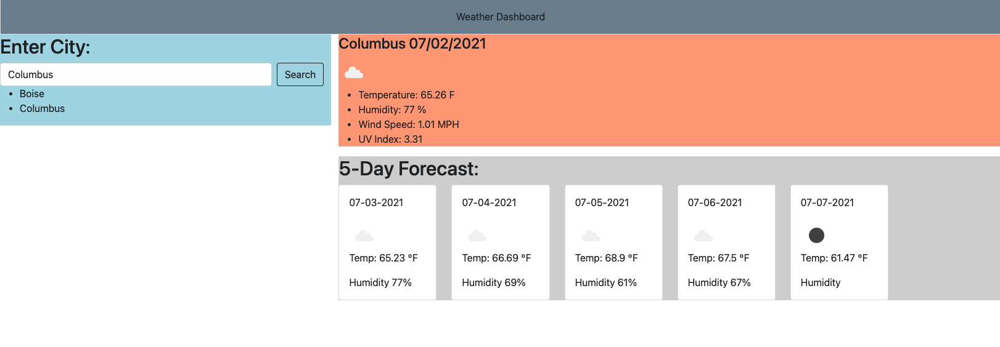

# Weather Dashboard

## Description

  This website will allow the user to get current weather and a five day forecast for a chosen geo-location. Using the Openweather API. Enter your desired city into the search bar, hit search, and the page will populate with the current day forecast and 5 day forecast for the chosen city.

## Built With

* [Openweather API](https://openweathermap.org/api)

* [JavaScript](https://www.javascript.com/)

* [Bootstrap](https://getbootstrap.com/)

## Links

Github Pages - https://cynwise.github.io/weatherDashboard/

## Contributers

William Farnsworth - [Github](https://github.com/Cynwise)
